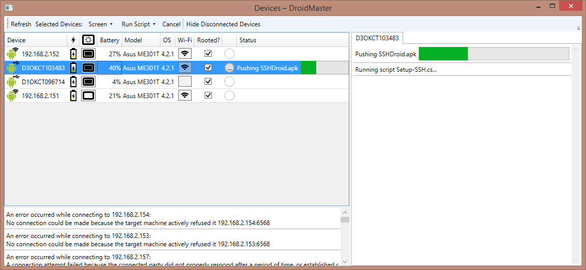

#DroidMaster
_A one-stop solution for bulk Android automation & scripting_

DroidMaster helps manage large numbers of Android phones and tablets.  It will automatically discover and connect to devices over USB (using ADB debugging) or Wi-Fi (connecting to SSH servers on the devices), and display device information in a grid.  Once the devices are connected, you can run C# or VB scripts against them for full automation capabilities

#Features
 - Automatic discovery over ADB or Wi-Fi
 - Sortable device grid displaying connection info, battery, model name, and screen, Wi-Fi, and rooted status
 - Full device automation using C# or VB scripts
 - Full per-device script log, with live progress bars for file transfers
 - Scripts will automatically wait for disconnected devices to reconnect before resuming
 - Scripts will resume on the same device after reconnection, even if reconnecting with a different method or IP address
 - Roslyn-powered script editor with full IntelliSense, syntax highlighting, and live error checking (requires any edition of Visual Studio 2015 to be installed)

#Screenshots

#Requirements
 - For USB connections:
  - The host computer must have an ADB server running.  DroidMaster will attempt to find and start `adb.exe` if it's in the current directory or the search path; otherwise, you must start it yourself.
  - All devices must have USB debugging enabled.
 - For Wi-Fi connections:
  - All devices must have an SSH server running with password authentication.
  - You must enter a range of IP addresses to scan for SSH servers.  
  - If there are non-Android devices running an SSH server in the range with the same port and authentication, strange things may happen (failed connections or authentications are logged and ignored)
 - For scripting:
  - All scripts must be placed in a `Scripts` folder within the current directory
  - To use the editor, the most recent beta of Visual Studio 2015 must be installed.  (this is only required for the editor; without Visual Studio, you can create scripts in any text editor and still run them normally.
